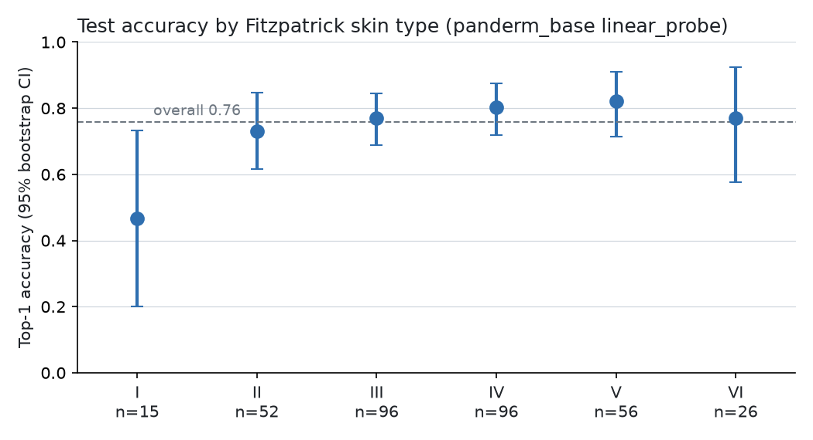
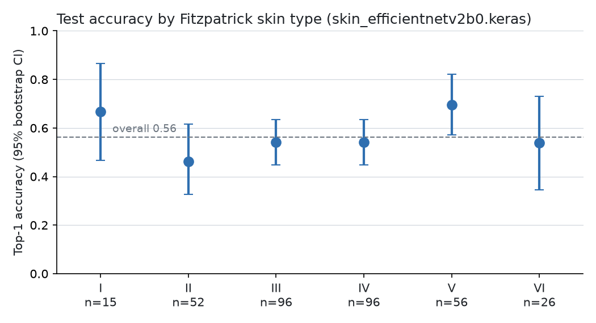

# SkinDetection: skin-condition classification measured across skin tones

> **Research prototype. Not a medical device, not a diagnosis, not clinically validated, and not a
> replacement for a dermatologist.** Model outputs are visual-similarity scores among a fixed set of
> 26 conditions and are frequently wrong.

## Purpose

The research question here is not only "how accurate is the model?" but:

> **How accurate is the model, and does its performance materially change across skin tones?**

Dermatology image datasets and models have historically under-represented darker skin. This POC
trains a small image classifier and **reports its performance separately for every Fitzpatrick
skin type (I–VI) and for lighter (I–III) vs. darker (IV–VI) skin**, with sample sizes and
confidence intervals. It does not claim to have solved bias. It measures it.

## Dataset

- **Fitzpatrick17k** ([Groh et al., 2021](https://github.com/mattgroh/fitzpatrick17k)); metadata is in
  `data/fitzpatrick17k.csv`. The current model is trained on Fitzpatrick17k only. It has **not**
  been trained on Google's SCIN dataset (see `docs/SCIN_INTEGRATION_PLAN.md` for future plans).
- The subset used: the 26 conditions of the original project, images from `atlasdermatologico.com.br`
  (the `dermaamin.com` images are excluded, as in the original project), minus rows the dataset's
  QC flagged "wrongly labelled". **2,346 images** were downloadable (3 of 2,349 failed).
- Skin tone is the dataset's `fitzpatrick_scale` annotation: an estimate made from the image by
  annotators, not self-reported. The dataset's second annotation agrees with it only about 46% of
  the time, so skin-tone labels are themselves noisy. 97 images have unknown skin type and are
  reported as a separate "unknown" group.
- There is no patient or lesion identifier, so different photos of the same patient may fall into
  different splits. Exact duplicates and perceptual near-duplicates are grouped before splitting.

## Limitations

- Research prototype; **no clinical validation; not a medical device; not for diagnosis or triage.**
- Only 26 conditions. Every image, including healthy skin or a non-skin photo, gets assigned to one
  of them.
- Small dataset (1,642 training images; some classes have fewer than 20 training images) from a
  single atlas source, with textbook-style clinical photos that differ from phone photos taken by patients.
- Skin-type annotations are noisy (see above), and subgroup test sets are small (e.g. Fitzpatrick I
  and VI each have fewer than 30 test images), so per-type numbers have wide confidence intervals.
- Possible patient-level leakage (no patient IDs).
- Softmax scores are not calibrated probabilities.

## Architecture

```
data/fitzpatrick17k.csv
  └─ scripts/prepare_dataset.py    load → filter labels → drop duplicates → fetch images
                                    → group near-duplicates → GROUP-LEVEL stratified split
                                    → data/splits.csv (one row per original image: train/val/test)
  └─ scripts/train.py              train+val only. On-the-fly augmentation (train only)
                                    → two-stage fine-tuning of an ImageNet backbone → best-val checkpoint
                                    → models/skin_<backbone>.keras + models/skin_<backbone>_class_names.json
  └─ scripts/evaluate.py           test split only → reports/ (overall, per class, per Fitzpatrick type)
  └─ app.py                        Streamlit demo: same preprocessing, same class mapping
```

Package `skin_detection/`:

| module | responsibility |
|---|---|
| `config.py` | paths (all overridable via `SKIN_*` env vars), default backbone, seed, default labels |
| `data.py` | dataset adapter to a common schema, filtering, duplicate detection, group split, leakage checks, sample weights |
| `preprocessing.py` | **the only** image preprocessing: EXIF orientation, RGB, resize, backbone normalization |
| `model.py` | backbone registry, model construction, stage-B unfreezing, validated save/load (model ↔ class names) |
| `training.py` | image loading, augmentation, tf.data pipeline, two-stage training |
| `evaluation.py` | metrics incl. Fitzpatrick-stratified metrics, gaps, CIs, calibration |
| `inference.py` | top-k, uncertainty display rule |

**Model:** ImageNet-pretrained backbone → GlobalAveragePooling → Dense(256, ReLU, L2 1e-4) →
Dropout(0.5) → softmax(26). Input 224×224. Backbones (`--backbone`), all CNNs from `keras.applications`
with no extra dependencies:

| backbone | year | params | role | stage-B unfreezes from |
|---|---|---|---|---|
| `efficientnetv2b0` | 2021 | 5.9M | **default** | `block6a_expand_conv` |
| `convnext_tiny` | 2022 | 28M | newest in Keras; about 6× the compute of B0, GPU advised | `convnext_tiny_downsampling_block_2` (stage 4) |
| `mobilenetv2` | 2018 | 2.3M | baseline, same architecture family as the original project | `block_13_expand` |

**PanDerm_Base** (ViT-B/16 dermatology foundation model, PyTorch, separate environment) is the
dermatology-specific model under evaluation. It is trained as a frozen-encoder linear probe
(`--mode linear_probe`) or with its top 2 transformer blocks unfrozen (`--mode partial_finetune`), on
the same split. It uses PanDerm's official preprocessing (Resize 256 → center crop 224, PanDerm
normalization) instead of padding. Setup, licence (CC-BY-NC-ND 4.0) and every deviation from the official
recipe are in [docs/PANDERM.md](docs/PANDERM.md).

**Preprocessing** (identical everywhere): EXIF transpose → RGB → scale the longer side to 224
(bilinear), then pad the shorter side symmetrically with black. There is no stretching and no
cropping, so a lesion near the edge is not cut off. Then the backbone's normalization, recorded in
the model's metadata: `x / 127.5 − 1` for MobileNetV2; raw 0–255 pixels for EfficientNetV2 and
ConvNeXt (they normalize inside the network).

**Training** (`scripts/train.py`):
- *Stage A*: backbone frozen, head trained (Adam 1e-3, up to 15 epochs).
- *Stage B (actual fine-tuning)*: layers from `block_13_expand` onward are unfrozen (last 4
  inverted-residual blocks + final conv). **All BatchNormalization layers stay frozen**, and the
  backbone always runs in inference mode. Recompiled with Adam 1e-5, up to 20 epochs.
- Early stopping and checkpointing monitor **validation balanced
  accuracy** (LR reduction monitors validation loss); the saved model is the best validation checkpoint across both stages.
- Seeds are fixed (`--seed`, default 42); `--deterministic` enables TF op determinism.

**Augmentation** (training images only, on the fly, never saved): horizontal flip, rotation ±14°,
translation ±5%, zoom ±10%, brightness ±10%, contrast ×0.9–1.1. **No color inversion, no hue or
saturation shifts, no vertical flips.** Skin and lesion color carry diagnostic information, and
recoloring light-skin images does not produce realistic darker-skin examples.

**Class imbalance and skin-tone representation**: the original scripts undersampled every class to
the rarest class, which discarded about 75% of images. Nothing is discarded now. Each training image
gets a loss weight: tone groups (I–III / IV–VI / unknown) are weighted to equal total weight, then
rescaled so every class carries equal total weight, clipped at 10× the mean.

**Class mapping:** training writes `models/skin_<backbone>_class_names.json` (class order, backbone,
image size, resize mode, normalization). Loading fails loudly if the model's output size or input
size disagrees with it.

## Setup

```bash
python -m venv .venv && source .venv/bin/activate   # Python 3.10-3.13 (TensorFlow 2.21)
pip install -r requirements-train.txt               # app only: pip install -r requirements.txt
```

PanDerm needs a second environment (PyTorch; `requirements-panderm.txt`), the official code clone and
the checkpoint. See [docs/PANDERM.md](docs/PANDERM.md). TensorFlow and PyTorch are kept apart to avoid
dependency conflicts.

## Reproduce

```bash
# 1. Fetch images (~2.3k files, ~150 MB) into data/images/ and build data/splits.csv.
#    data/splits.csv is committed. Re-running with the same seed and the same available images
#    reproduces it.
python scripts/prepare_dataset.py --download url --near-duplicates
#    Alternative source: images in S3 as <prefix><md5hash>.jpg, credentials via the normal AWS chain
#    SKIN_S3_BUCKET=my-bucket python scripts/prepare_dataset.py --download s3 --near-duplicates

# 2. Train (EfficientNetV2-B0 by default; CPU is workable, a GPU is much faster)
python scripts/train.py
python scripts/train.py --backbone mobilenetv2     # baseline for comparison
python scripts/train.py --backbone convnext_tiny   # newest supported backbone (GPU advised)

# 3. Final evaluation on the held-out test split (reports/<backbone>/)
python scripts/evaluate.py
python scripts/evaluate.py --backbone mobilenetv2
python scripts/evaluate.py --legacy      # the original 2024 model, for comparison (see caveat)

# PanDerm_Base (PyTorch environment, see docs/PANDERM.md)
python scripts/train.py    --backbone panderm_base --mode linear_probe
python scripts/train.py    --backbone panderm_base --mode partial_finetune
python scripts/evaluate.py --backbone panderm_base --mode linear_probe
python scripts/compare_models.py         # reports/model_comparison.{csv,md} from the test reports

# Tests (run in each environment; tests for the other framework skip)
pytest
```

**Held-out test set:** the test split in `data/splits.csv` is used **only** by `scripts/evaluate.py`.
It must not be used for model selection, hyperparameter tuning, augmentation design, early stopping
or threshold choices. Use `python scripts/evaluate.py --split val` during development.

## Evaluation

`scripts/evaluate.py` writes to `reports/<backbone>/`:

- `metrics.json`: all metrics, machine-readable
- `per_class.csv`: precision, recall, F1 and number of test images per class
- `fitzpatrick_metrics.csv`: n, accuracy (95% bootstrap CI), balanced accuracy, macro
  precision/recall/F1, top-3 accuracy, for Fitzpatrick I…VI, lighter (I–III), darker (IV–VI) and unknown
- `per_class_recall_by_tone.csv`: per-class recall for lighter vs. darker skin
- `confusion_matrix.csv/.png`, `fitzpatrick_accuracy.png`, `predictions.csv`

Overall metrics: accuracy, balanced accuracy, macro precision/recall/F1, top-3 accuracy, confusion
matrix, and calibration (expected calibration error and a reliability table).

Fairness metrics: `accuracy_gap = lighter_accuracy − darker_accuracy` (positive means worse on darker
skin), plus the same gap for balanced accuracy, macro recall, macro F1 and top-3 accuracy, and a
bootstrap 95% CI for the accuracy gap. Groups with fewer than 100 test images are flagged
`reliable: false`. Macro metrics inside a subgroup cover only the classes present in that subgroup.
**A small or statistically insignificant gap is not evidence of fairness.** With these sample sizes
the study can only detect large differences.

## Results (held-out test split, 352 images)

All models below use the same `data/splits.csv` and the same 352 test images, which were used only for
these final evaluations. Generated on 2026-09-23 by `scripts/evaluate.py`: TensorFlow models trained on CPU
(TensorFlow 2.21), PanDerm on an Apple M2 GPU (PyTorch 2.14, MPS, float32). Seed 42. Single training run
per model: run-to-run variance has not been measured. Full details are in `reports/<model>/`.

### Model comparison

Generated by `scripts/compare_models.py` (`reports/model_comparison.csv`). "Gap" = lighter − darker
accuracy (negative = better on darker skin).

| model | accuracy | balanced acc. | macro F1 | top-3 | lighter I–III acc. (n=163) | darker IV–VI acc. (n=178) | gap [95% CI] | macro-F1 gap | ECE |
|---|---|---|---|---|---|---|---|---|---|
| MobileNetV2 | 0.469 | 0.415 | 0.410 | 0.713 | 0.448 | 0.483 | −0.035 [−0.135, +0.075] | −0.067 | 0.040 |
| EfficientNetV2-B0 | 0.562 | 0.551 | 0.525 | 0.790 | 0.528 | 0.590 | −0.062 [−0.170, +0.043] | −0.025 | 0.068 |
| **PanDerm_Base linear probe** | **0.759** | **0.741** | **0.751** | **0.932** | **0.730** | **0.803** | −0.073 [−0.164, +0.014] | −0.083 | 0.159 |
| PanDerm_Base partial FT | 0.659 | 0.693 | 0.655 | 0.864 | 0.650 | 0.669 | −0.018 [−0.120, +0.088] | +0.020 | 0.172 |

- **PanDerm_Base linear probe is the best model on this dataset** on every overall metric: macro F1
  0.751 vs. 0.525 for EfficientNetV2-B0. Its per-class recall is higher than EfficientNetV2-B0's for 18
  of 26 conditions and equal for the other 8. Darker-skin (IV–VI) accuracy is 0.803 vs. 0.590, and
  darker-skin macro F1 is 0.753 vs. 0.508.
- **Partial fine-tuning did worse than the linear probe** (validation balanced accuracy 0.700 vs.
  0.784, test macro F1 0.655 vs. 0.751). With 1,642 training images, updating the top 2 blocks under
  this recipe lost more than it gained. It has the smallest lighter/darker gap, but at a lower
  level of performance for both groups.
- **Calibration got worse.** PanDerm's scores are over-confident: the linear probe's mean top-1 score
  is 0.918 against 0.759 accuracy (ECE 0.159). Displayed percentages overstate certainty even more
  than for the CNNs.
- **Validation → test:** linear probe validation balanced accuracy 0.784, test 0.741.

### By skin tone: PanDerm_Base linear probe



| group | n (test) | PanDerm LP accuracy [95% CI] | PanDerm LP macro F1 | EfficientNetV2-B0 accuracy [95% CI] |
|---|---|---|---|---|
| Fitzpatrick I | 15 | 0.467 [0.20, 0.73] | 0.385 | 0.667 [0.47, 0.87] |
| Fitzpatrick II | 52 | 0.731 [0.61, 0.85] | 0.633 | 0.462 [0.33, 0.62] |
| Fitzpatrick III | 96 | 0.771 [0.69, 0.84] | 0.741 | 0.542 [0.45, 0.64] |
| Fitzpatrick IV | 96 | 0.802 [0.72, 0.88] | 0.808 | 0.542 [0.45, 0.64] |
| Fitzpatrick V | 56 | 0.821 [0.71, 0.91] | 0.766 | 0.696 [0.57, 0.82] |
| Fitzpatrick VI | 26 | 0.769 [0.58, 0.92] | 0.742 | 0.538 [0.35, 0.73] |
| **Lighter I–III** | 163 | 0.730 | 0.669 (macro recall 0.686) | 0.528 |
| **Darker IV–VI** | 178 | 0.803 | 0.753 (macro recall 0.769) | 0.590 |

- Accuracy gap (lighter − darker) −0.073, 95% CI [−0.164, +0.014]; case-mix controlled (16 shared
  conditions) macro recall 0.704 lighter vs. 0.775 darker.
- The confidence interval includes 0. The data do not show a disadvantage for darker skin, but they also
  cannot establish that the groups perform equally. **This is not a fairness claim.**
- **Fitzpatrick I is the weakest group for PanDerm (0.467), and it has only 15 test images.** Its
  interval spans 0.20–0.73, so this may be noise, but it is the opposite direction from the
  historical concern and should be watched as more data arrive.
- Every individual type has fewer than 100 test images and is flagged `reliable: false`.
- Fitzpatrick17k's atlas source is about 47% type IV–VI. Results may not transfer to datasets where
  darker skin is rare.

### Legacy 2024 model (not comparable)

The legacy model scores accuracy 0.582, balanced accuracy 0.630, macro F1 0.579, top-3 0.767 and ECE
0.089 on this test split. **These numbers are not comparable.** It was trained on a random split of
augmented rows drawn from these same images, so most of this test set was probably in its training
data. Reported for transparency only; not a held-out estimate.

The validation split, used to select checkpoints, scored higher than test for every model (e.g.
EfficientNetV2-B0 validation balanced accuracy 0.644 vs. 0.551 on test). That gap is why only test
numbers are reported as results.

### By skin tone: EfficientNetV2-B0 (the app's default model)



| group | n (test) | accuracy [95% CI] | macro F1 |
|---|---|---|---|
| Fitzpatrick I | 15 | 0.667 [0.47, 0.87] | 0.545 |
| Fitzpatrick II | 52 | 0.462 [0.33, 0.62] | 0.414 |
| Fitzpatrick III | 96 | 0.542 [0.45, 0.64] | 0.509 |
| Fitzpatrick IV | 96 | 0.542 [0.45, 0.64] | 0.558 |
| Fitzpatrick V | 56 | 0.696 [0.57, 0.82] | 0.581 |
| Fitzpatrick VI | 26 | 0.538 [0.35, 0.73] | 0.376 |
| **Lighter I–III** | 163 | 0.528 | 0.484 (macro recall 0.501) |
| **Darker IV–VI** | 178 | 0.590 | 0.508 (macro recall 0.554) |
| unknown | 11 | 0.636 | not reliable |

- **Accuracy gap (lighter − darker): −0.062, 95% CI [−0.170, +0.043].** Balanced-accuracy gap
  −0.053; macro-F1 gap −0.025.
- **Case-mix controlled** (the 16 conditions with ≥3 test images in both groups): macro recall
  0.481 lighter vs. 0.499 darker (gap −0.017).
- **Interpretation:** on this dataset the model does **not** show worse performance on darker skin,
  but the confidence interval spans roughly ±11 points, so a difference of that size could not be
  detected. This is **not** evidence that the model is fair. Every individual Fitzpatrick type has
  fewer than 100 test images and is flagged `reliable: false`. Types I and VI (15 and 26 images) are
  far too small for per-type conclusions, and type VI macro F1 (0.376) is the lowest of any group.
  The source atlas is Brazilian and roughly half of its images are type IV–VI, which is unusual for
  dermatology datasets. Results may not transfer to datasets where darker skin is rare.
- MobileNetV2 shows the same pattern (gap −0.035, CI [−0.135, +0.075]).


## Running the app

```bash
streamlit run app.py
```

The app loads the model for `SKIN_BACKBONE` (default `efficientnetv2b0`). If that one isn't trained,
it uses another retrained backbone; if none is trained, it loads the legacy model with a banner. The
model in use is always named on the page. `SKIN_MODEL_PATH` / `SKIN_MODEL_META_PATH` set explicit paths. If loading fails, the app shows an error and makes no predictions. It never falls back
to an untrained network. The app shows the top 3 model outputs, an uncertainty message when the top
score is below 50% or the scores are spread out (these cut-offs are UX choices, not clinical
thresholds), and a research disclaimer. It gives no treatment advice.

PanDerm is **opt-in only** (the default stays EfficientNetV2-B0) and needs the PyTorch environment:

```bash
MODEL_TYPE=panderm_base PANDERM_MODE=linear_probe streamlit run app.py
```

It uses the same preprocessing as PanDerm training (from `models/panderm_base/class_names.json`).
PanDerm is CC-BY-NC-ND 4.0: non-commercial research use only.

## Legacy model

`models/finetuned_mobilenetv2.h5` (and `non_fine_tuned_mobilenetv2.h5`) are the original 2024
models, kept for comparison. The scripts that produced them are in `scripts/legacy/` (see its README).
Despite its name, the "fine-tuned" model has a frozen ImageNet backbone (verified: its backbone
weights are identical to ImageNet's). It was evaluated on a split with augmentation leakage, so the
previously reported ~56% accuracy is not a valid held-out estimate. Its class order was reconstructed as
the alphabetical `LabelEncoder` order in `models/finetuned_mobilenetv2_class_names.json`. The old
app's hard-coded list had "granuloma annulare" and "granuloma pyogenic" swapped (and the old app never
loaded the trained weights at all).

## Citation

```
@inproceedings{groh2021evaluating,
  title={Evaluating deep neural networks trained on clinical images in dermatology with the fitzpatrick 17k dataset},
  author={Groh, Matthew and Harris, Caleb and Soenksen, Luis and Lau, Felix and Han, Rachel and Kim, Aerin and Koochek, Arash and Badri, Omar},
  booktitle={Proceedings of the IEEE/CVF Conference on Computer Vision and Pattern Recognition},
  pages={1820--1828},
  year={2021}
}
```
